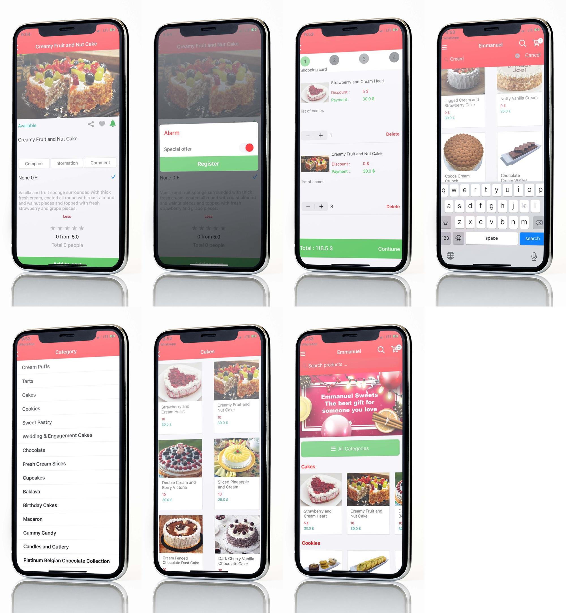

# Emmanuel – Online Confectionery Store

**Emmanuel** is an online confectionery store based in the **United Kingdom**, designed to provide a seamless shopping experience for sweet lovers. This project is a **demo application**, showcasing a fully functional e-commerce platform with modern features for browsing, comparing, and purchasing confectionery products.

## ✨ Features

- **🛒 Shopping Cart** – Easily add multiple products to your cart and proceed to checkout.
- **🔄 Product Comparison** – Compare multiple products side by side before making a purchase decision.
- **📧 User Registration** – Sign up and log in using your email for a personalized experience.
- **📂 Product Categories** – Browse products through well-organized categories.
- **🎯 Advanced Filtering** – Find products quickly with filters for price, category, and other attributes.
- **🔔 Push Notifications** – Stay updated with the latest offers and promotions via notifications.
- **💳 Secure Online Payments** – Integrated with **Stripe** for a smooth and secure checkout experience.

## 🛠️ Tech Stack

### Backend:
- **Node.js** – Used to power the backend, ensuring high performance and scalability.

### Mobile Applications:
- **iOS (Native)**
- **Android (Native)**

# Emmanuel - Online Confectionery Store

## Overview
Emmanuel is a modern and intuitive online confectionery store based in the United Kingdom, designed to offer customers a seamless shopping experience for their favorite sweets and baked goods. The platform provides a user-friendly interface with powerful features that allow customers to browse, compare, and purchase products with ease.

## Features
- **Shopping Cart**: Users can add multiple items to their cart and proceed to checkout smoothly.
- **Product Comparison**: Allows users to compare multiple products side by side before making a decision.
- **User Registration with Email**: Customers can create an account using their email to track orders and receive personalized offers.
- **Product Categorization**: Items are grouped into well-structured categories for an enhanced browsing experience.
- **Product Filtering**: Advanced filters help users narrow down their search based on price, type, or availability.
- **Push Notifications**: Customers receive real-time updates on new arrivals, promotions, and order status.
- **Secure Online Payment**: Transactions are processed through **Stripe**, ensuring a safe and secure checkout experience.

## Technology Stack
- **Backend**: Node.js
- **Mobile Applications**: Native development for **iOS** and **Android**
- **Payment Gateway**: Stripe

## Screenshots

1. 

## Deployment
This project is intended for **demonstration purposes only** and does not require installation instructions.

## Contributors
- **Sina Khanjani** - Team Lead (Backend & iOS Developer)

## License
This project is for demo use only and is not intended for commercial deployment.

## 📌 Note

This project is solely for **demo purposes** and does **not** include installation instructions.

---